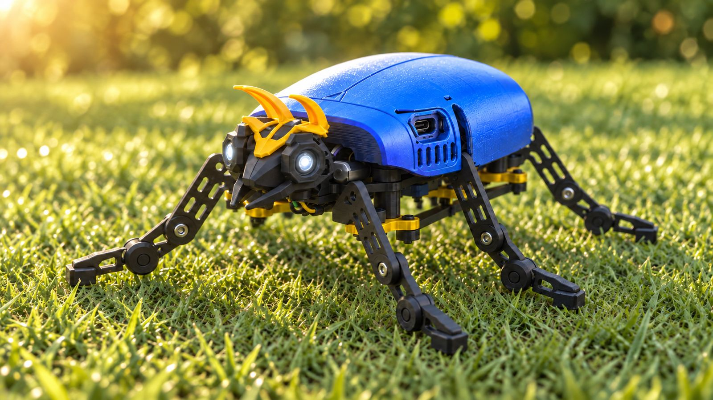

# 🪲 POLO — Walking Beetle Robot / Escarabajo Robot Caminante

<p align="center">
  
</p>

<p align="center">
  <b><a href="#-english">🇬🇧 English</a> · <a href="#-español">🇪🇸 Español</a></b>
</p>

---

<a name="-english"></a>

## 🇬🇧 English

Can a six-legged robot be made to walk with just three motors? **POLO** is a **fully 3D-printable** beetle robot, inspired by the *pololo* —a Chilean beetle— and by the minimalist walkers of **Mark Tilden**, to whom this project pays tribute.

This isn't just an electronics project. It's an exercise in mechanics: print-in-place ball joints, lobular couplers, connecting rods and a central rocker that, together, make six legs move in a fluid, almost organic way.

### 🎯 What does this robot do?

- Walks forward, backward and turns using **only 3 servos**
- Controlled from your phone **over WiFi, no apps**, straight from the browser
- Has **4 walking speeds**: very fast, fast, slow and stealthy
- Its eyes pulse, simulating a beetle's heartbeat
- Emits **stridulation** sounds through a buzzer, just like real beetles
- Charges via **USB-C** without removing the shell

### ⚙️ Main components

| Component | Detail |
|-----------|--------|
| Microcontroller | ESP32-C3 Super Mini |
| Actuators | 3 × SG90 servos |
| Battery | 803040 LiPo, 1000 mAh (3.7 V) |
| Power management | PB0063A module (IP5306): charging, protection and 5 V boost |
| Filtering | 470 µF electrolytic capacitor |
| Eyes | 2 × 5 mm LEDs |
| Sound | Passive buzzer |
| PCB | POLO PCB (manufactured by PCBWay) or hand-built on perfboard |
| Structure | 3D-printed parts (PLA) |

### 🧠 Philosophy behind the project

Today electronics and software are within anyone's reach, especially with the help of AI. Mechanics, on the other hand, still surprises. That's why the heart of POLO is not in the code, but in how its parts move.

The robot draws on **BEAM**, Mark Tilden's philosophy: achieving complex behaviors with the fewest possible components. One servo moves both legs on the left side, another the right side, and a third drives a central rocker that tilts the body to lift the legs on the opposite side.

POLO is also a learning project. A walker like this can be made with 2 servos, and probably better. This is my path toward that, and I'm sharing it in full so others can improve it.

### 🔩 Mechanical features

- **100% printable**: all structural parts are 3D-printed
- Print-in-place articulated ball joints, in a single piece and **without supports**: the ankle drops about 45° when the leg lifts and self-levels when it lands
- Elongated flat-soled feet for better traction
- Indexed 10-lobe lobular couplers (36° steps) to adjust the position of each tibia
- Mechanical connecting rods and a central rocker driven by the same 3 servos
- Topology optimization to reduce weight, material and power consumption
- Elytra-style shell screwed to the chassis, with openings for the USB-C ports
- Snap-on helmet with horns that double as antennae
- Size: about **12.6 cm** from leg tip to leg tip

### 📡 Technical features

- **WiFi in access-point mode**: the robot creates its own network, no router needed
- Responsive web interface with two views: **control** and **configuration**
- Low-latency control: hold an arrow to walk and release to return to rest
- Servo calibration and gait routines (angles and speed) from the browser
- Default values measured with an oscilloscope, ready for anyone who can't calibrate
- Independent control of each eye with PWM dimming
- Free **I2C (Qwiic)** port so you can add your own sensors
- Measured consumption: **~0.36 A at 5 V (1.75 W)**

### 🔌 Electrical connections

**ESP32-C3 Super Mini:**

| GPIO | Function |
|------|----------|
| GPIO 4 | Left leg servo |
| GPIO 3 | Right leg servo |
| GPIO 2 | Central rocker servo |
| GPIO 10 | LED eye 1 (cathode; anode to 5 V through a resistor) |
| GPIO 1 | LED eye 2 (cathode; anode to 5 V through a resistor) |
| GPIO 7 | Buzzer (signal S) |
| GPIO 5 | SDA (Qwiic port) |
| GPIO 6 | SCL (Qwiic port) |

**Power:** LiPo battery → IP5306 module → 5 V rail. The ESP32 and the 3 servos share the 5 V rail, with a 470 µF capacitor.

See the full schematic in [`hardware/Esquematico.png`](hardware/Esquematico.png).

### 🛠️ Build your own PCB with PCBWay

POLO's board is designed to fit exactly into the chassis. It's 2-layer and measures **50.1 × 40.3 mm**, with an outline cut to the robot's shape. It has a black solder mask and white silkscreen, easy-to-solder through-hole components, ground planes on both sides and two USB-C ports (charging and programming).

Thanks to **PCBWay**, sponsor of this project's PCB, you can order the same board directly from their platform. The Gerber files are in [`hardware/Gerber_POLO_PCB.zip`](hardware/Gerber_POLO_PCB.zip).

If you prefer to build it by hand, POLO's first prototype worked perfectly on **perfboard**.

### 🚀 Installation and setup

1. Print the parts (recommended: PLA, 0.12 mm layer height; the ball-jointed tibias are printed flat-side down on the bed, without supports)
2. Solder the PCB or build the circuit on perfboard according to the schematic
3. Flash the firmware ([`firmware/POLO_v7_1.ino`](firmware/POLO_v7_1.ino)) onto the ESP32-C3 via the programming USB-C port
4. Mount the servos in their rest position before attaching the legs
5. Power on POLO and connect from your phone to its WiFi network
6. Open the robot's IP in your browser
7. In the configuration view, adjust the rest position and gait if needed
8. Switch to the control view and make it walk!

**Customizable configuration (from the web):** rest position of each servo (default **60° / 111° / 68°**), swing angles for forward/backward/turn, gait period (default **700 ms**), walking speeds, and eyes on/off + brightness.

### 📁 Repository contents

```
polo/
├── firmware/
│   └── POLO_v7_1.ino          # Firmware for the ESP32-C3
├── hardware/
│   ├── Esquematico.png         # Circuit schematic
│   ├── PCB_Diseno.png          # PCB design
│   └── Gerber_POLO_PCB.zip     # Gerber files for manufacturing
└── images/                     # Robot photos
```

> **Note:** the Fusion 360 design and the STL files will be added soon.

### 🧰 Technologies

ESP32-C3 · SG90 servos · 3D printing · Fusion 360 · EasyEDA · PCBWay · WiFi AP · Embedded web server · PWM · I2C

### 📜 License

This project is released under the **MIT** license. You can modify, adapt and improve it. See [LICENSE](LICENSE).

---

<a name="-español"></a>

## 🇪🇸 Español

¿Se puede hacer caminar un robot de seis patas con solo tres motores? **POLO** es un escarabajo robot **100% imprimible**, inspirado en el *pololo* —un escarabajo chileno— y en los caminantes minimalistas de **Mark Tilden**, a quien este proyecto rinde tributo.

Este no es solo un proyecto de electrónica. Es un ejercicio de mecánica: rótulas impresas en una sola pieza, acoples lobulares, bielas y un balancín que, juntos, hacen que seis patas se muevan de forma fluida y casi orgánica.

### 🎯 ¿Qué hace este robot?

- Camina hacia adelante, hacia atrás y gira usando **solo 3 servos**
- Se controla desde el celular **por WiFi, sin apps**, directo desde el navegador
- Tiene **4 velocidades de marcha**: muy rápido, rápido, lento y sigiloso
- Sus ojos pulsan simulando el latido del corazón de un escarabajo
- Emite sonidos de **estridulación** con un buzzer, igual que los escarabajos reales
- Se carga por **USB-C** sin quitar el caparazón

### ⚙️ Componentes principales

| Componente | Detalle |
|-----------|---------|
| Microcontrolador | ESP32-C3 Super Mini |
| Actuadores | 3 servos SG90 |
| Batería | LiPo 803040 de 1000 mAh (3,7 V) |
| Gestión de energía | Módulo PB0063A (IP5306): carga, protección y elevador a 5 V |
| Filtrado | Condensador electrolítico de 470 µF |
| Ojos | 2 LEDs de 5 mm |
| Sonido | Buzzer pasivo |
| PCB | POLO PCB (fabricada por PCBWay) o perfboard armada a mano |
| Estructura | Piezas impresas en 3D (PLA) |

### 🧠 Filosofía del proyecto

Hoy la electrónica y el software están al alcance de cualquiera, sobre todo con la ayuda de la IA. La mecánica, en cambio, sigue sorprendiendo. Por eso el corazón de POLO no está en el código, sino en cómo se mueven sus piezas.

El robot se inspira en **BEAM**, la filosofía de Mark Tilden: lograr comportamientos complejos con el mínimo de componentes. Un servo mueve las dos patas del lado izquierdo, otro las del lado derecho, y un tercero acciona un balancín central que inclina el cuerpo para levantar las patas del lado contrario.

POLO es también un proyecto de aprendizaje. Un caminante así se puede hacer con 2 servos, y probablemente mejor. Este es mi camino para llegar a él, y lo comparto completo para que otros lo mejoren.

### 🔩 Características mecánicas

- **100% imprimible**: todas las piezas estructurales son impresas en 3D
- Rótulas articuladas impresas en sitio, en una sola pieza y **sin soportes**: el tobillo cae unos 45° al levantar la pata y se autonivela al apoyar
- Pies de suela plana alargada para mejor tracción
- Acoples lobulares indexados de 10 lóbulos (pasos de 36°) para ajustar la posición de cada tibia
- Bielas mecánicas y balancín central movidos por los mismos 3 servos
- Optimización topológica para reducir peso, material y consumo
- Caparazón tipo élitro atornillado al chasis, con aberturas para los puertos USB-C
- Casco con cachos a presión, que hacen las veces de antenas
- Tamaño: unos **12,6 cm** de punta a punta de patas

### 📡 Características técnicas

- **WiFi en modo punto de acceso**: el robot crea su propia red, sin necesidad de router
- Interfaz web responsive con dos vistas: **manejo** y **configuración**
- Control de baja latencia: mantén presionada una flecha para caminar y suelta para volver a reposo
- Calibración de servos y rutinas de marcha (ángulos y velocidad) desde el navegador
- Valores por defecto medidos con osciloscopio, listos para quien no pueda calibrar
- Control independiente de cada ojo con atenuación por PWM
- Puerto **I2C (Qwiic)** libre para agregar tus propios sensores
- Consumo medido: **~0,36 A a 5 V (1,75 W)**

### 🔌 Conexiones eléctricas

**ESP32-C3 Super Mini:**

| GPIO | Función |
|------|---------|
| GPIO 4 | Servo pata izquierda |
| GPIO 3 | Servo pata derecha |
| GPIO 2 | Servo balancín central |
| GPIO 10 | LED ojo 1 (cátodo; ánodo a 5 V con resistencia) |
| GPIO 1 | LED ojo 2 (cátodo; ánodo a 5 V con resistencia) |
| GPIO 7 | Buzzer (señal S) |
| GPIO 5 | SDA (puerto Qwiic) |
| GPIO 6 | SCL (puerto Qwiic) |

**Alimentación:** Batería LiPo → módulo IP5306 → riel de 5 V. El ESP32 y los 3 servos comparten el riel de 5 V, con un condensador de 470 µF.

Ver el esquemático completo en [`hardware/Esquematico.png`](hardware/Esquematico.png).

### 🛠️ Fabrica tu propia PCB con PCBWay

La placa de POLO está diseñada para encajar exactamente en el chasis. Es de 2 capas y mide **50,1 x 40,3 mm**, con contorno recortado a la forma del robot. Lleva máscara negra y serigrafía blanca, componentes through-hole fáciles de soldar, planos de masa en ambas caras y dos puertos USB-C (carga y programación).

Gracias a **PCBWay**, patrocinador de la PCB de este proyecto, puedes pedir la misma placa directamente desde su plataforma. Los archivos Gerber están en [`hardware/Gerber_POLO_PCB.zip`](hardware/Gerber_POLO_PCB.zip).

Si prefieres armarla a mano, el primer prototipo de POLO funcionó perfectamente sobre **perfboard**.

### 🚀 Instalación y configuración

1. Imprime las piezas (recomendado: PLA, capa 0,12 mm; las tibias con rótula se imprimen con la cara plana sobre la cama, sin soportes)
2. Suelda la PCB o arma el circuito en perfboard según el esquema
3. Carga el firmware ([`firmware/POLO_v7_1.ino`](firmware/POLO_v7_1.ino)) en el ESP32-C3 por el puerto USB-C de programación
4. Monta los servos en su posición de reposo antes de fijar las patas
5. Enciende POLO y conéctate desde tu celular a su red WiFi
6. Abre la IP del robot en el navegador
7. En la vista de configuración, ajusta el reposo y la marcha si lo necesitas
8. ¡Pasa a la vista de manejo y hazlo caminar!

**Configuración personalizable (desde la web):** posición de reposo de cada servo (por defecto **60° / 111° / 68°**), ángulos de oscilación para avanzar/retroceder/girar, periodo de la marcha (por defecto **700 ms**), velocidades de marcha, y encendido/brillo de los ojos.

### 📁 Contenido del repositorio

```
polo/
├── firmware/
│   └── POLO_v7_1.ino          # Firmware para el ESP32-C3
├── hardware/
│   ├── Esquematico.png         # Esquemático del circuito
│   ├── PCB_Diseno.png          # Diseño de la PCB
│   └── Gerber_POLO_PCB.zip     # Archivos Gerber para fabricación
└── images/                     # Fotos del robot
```

> **Nota:** el diseño 3D en Fusion 360 y los STL se añadirán próximamente.

### 🧰 Tecnologías

ESP32-C3 · Servos SG90 · Impresión 3D · Fusion 360 · EasyEDA · PCBWay · WiFi AP · Servidor web embebido · PWM · I2C

### 📜 Licencia

Este proyecto está bajo la licencia **MIT**. Puedes modificarlo, adaptarlo y mejorarlo. Ver [LICENSE](LICENSE).

---

Made by / Hecho por **Alejandro Jesús Rodríguez Radomile** · [rodriguezalejandro.com](https://rodriguezalejandro.com)
